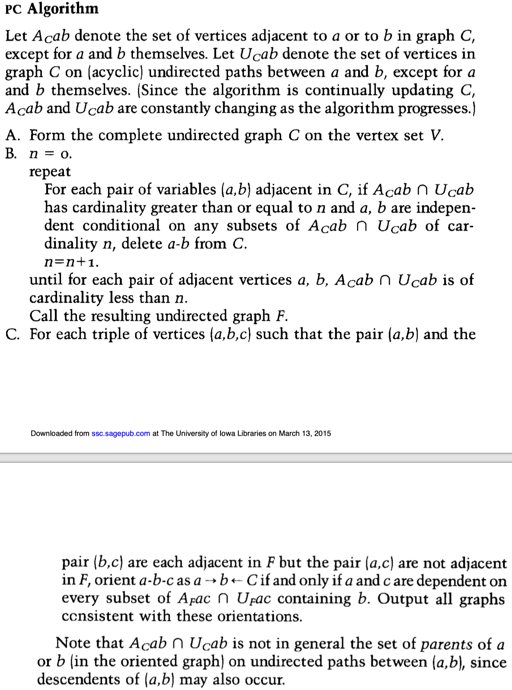
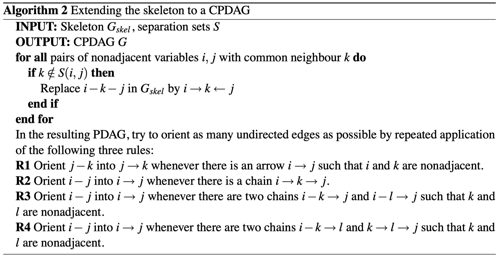

# 因果图：PC Algorithm 

## 基本定义

**Skeleton**：初始化图 $G$ 为无向完全图。

**PDAG**：设 $G = (V, E)$ 是一个图，若边集 $E$ 中包含有向边和无向边，则称𝑃 是一个部分有向图。若部分有向图 𝑃 中不存在有向圈，则称 𝑃 是一个部分有向无环图 (PDAG)。

**马尔科夫等价**：贝叶斯网络 $<G_1, P_1>$ 和 $<G_2, P_2>$马尔科夫等价, 当且仅当 $G_1$ 和 $G_2$ 具有相同的框架和V结构。

有向无环图 $G = (V, E)$ ，任意有向边 $V_i \rightarrow V_j ∈ E$，若存在图 $G' = (V, E')$ 与 $G$ 等价，且$V_j \rightarrow V_i ∈ E'$，则称有向边 $V_i \rightarrow V_j$ 在 $G$ 中是可逆的，否则是不可逆的。

同理, 对任意无向边 $V_i \rightarrow V_j ∈ E$，若存在  $G_1 = (V, E_1)$、  $G_2 = (V, E_2)$ 均与 $G$ 等价，且$V_i \rightarrow V_j ∈ E_1$、$V_j \rightarrow V_i ∈ E_2$， 则 称 无 向边 $V_i \rightarrow V_j$ 在 $G$ 中是可逆的，否则是不可逆的。

**CPDAG**：设 $G = (V, E)$ 是一个部分有向无环图，若 $E$ 中的有向边都是不可逆的，并且 $E$ 中的无向边都是可逆的，则称 $G$ 是一个完全部分有向无环图(CPDAG)。

## 传统方法

算法过程参考文献 [^2]，是经典的PC算法过程。

在文献[^1]中对其**skeleton**估计进行重写，如下所示：

## 条件独立性优化

### 偏相关系数

指校正其它变量后某一变量与另一变量的相关关系，校正的意思可以理解为假定其它变量都取值为均数

服从高斯分布的随机变量，条件独立性与偏相关系数为0等价：

假设随机变量 $X$ 服从多元高斯分布，对于$i \not =j∈(1, ..., p)，k⊆(1, ..., p) /\ (i，j)$，用 $ρ_{i，j|k}$ 表示 $X(i)$ 和 $X(j)$ 与 $X^{(r)} (r∈k)$ 之间的偏相关系数 。 当且仅当 $X(i)$ 和 $X( j )$ 条件独立与 $X^{(r)} (r∈k)$ 时，$ρ_{i，j|k}=0$。

∴ 条件独立性可由偏相关估计出来，条件独立性检验转偏相关系数检验。

任意两个变量$i, j$的$h$（排除其他$h$个变量的影响后，$h<=k-2$）阶样本偏相关系数：

$$
\rho_{i, j \mid \mathbf{k}}=\frac{\rho_{i, j \mid \mathbf{k} \backslash h} - \rho_{i, h \mid \mathbf{k} \backslash h}\rho_{j,h \mid \mathbf{k} \backslash h}}{\sqrt{\left(1-\rho_{i, h \mid \mathbf{k} \backslash h}^{2}\right)\left(1-\rho_{j, h \mid \mathbf{k} \backslash h}^{2}\right)}}
$$

### Fisher Z Test（$ρ\not=0$时的显著性检验）

$ρ\not=0$时不是正态分布，不能进行 $t$ 检验。将 $\rho$ 进行 Fisher Z 转换，转换后可以认为是正态分布。

Fisher’s z-transform:

$$
Z(i, j \mid \mathbf{k})=\frac{1}{2} \log \left(\frac{1+\hat{\rho}_{i, j \mid \mathbf{k}}}{1-\hat{\rho}_{i, j \mid \mathbf{k}}}\right)
$$
零假设：$H_0(i,j|k):  ρ_{i，j|k} \not= 0$

对立假设：$H_1(i,j|k):  ρ_{i，j|k} = 0$

当$\sqrt{n-|k|-3}|Z(i,j|k)>Φ^{-1}(1-α/2)$，$H_0$成立。

∴ 用$\sqrt{n-|k|-3}|Z(i,j|k)<=Φ^{-1}(1-α/2)$替换 PC-Algorithm 中的“如果 $i,j$ 被 $k$ $d-separation$”

### CPDAG

将 Skeleton 扩展为等价的CPDAG：

### 参考

[^1]: Kalisch, Markus, and Peter Bühlmann. "Estimating high-dimensional directed acyclic graphs with the PC-algorithm." *Journal of Machine Learning Research* 8.Mar (2007): 613-636.
[^2]: Spirtes, Peter, and Clark Glymour. "An algorithm for fast recovery of sparse causal graphs." *Social science computer review* 9.1 (1991): 62-72.